<div align="center">

# ⚖️ UK Legal Skills

### A junior counsel in your terminal — for England & Wales law.

**38 legal skills · 12 agents · live access to the entirety of England & Wales statute and case law — installed straight into [Claude Code](https://claude.com/claude-code) as `/legal` commands.**

[](LICENSE)
[](registry/skill-registry.json)
[](agents/)
[](.mcp.json)
[](#-jurisdiction--legal-currency)
[](https://claude.com/claude-code)
[](CONTRIBUTING.md)
[](https://github.com/davendra/uk-legal-skills/commits/main)
[](https://github.com/davendra/uk-legal-skills)
[](https://github.com/davendra/uk-legal-skills/stargazers)

</div>

> [!WARNING]
> **Not legal advice.** Everything here is AI-generated legal *analysis* and *drafting*, intended as a starting point. It is **not** a substitute for a qualified solicitor, and it covers **England & Wales only**. Always have a solicitor review before you sign a contract or rely on a generated document.

---

## 📑 Table of Contents

- [Why this exists](#-why-this-exists)
- [At a glance](#-at-a-glance)
- [System architecture](#-system-architecture)
- [Quick start](#-quick-start)
- [The 38 commands](#-the-38-commands)
- [Orchestrators & agents](#-orchestrators--agents)
- [How a review flows](#-how-a-review-flows)
- [Business flows & who it's for](#-business-flows--who-its-for)
- [Live UK legal data (MCP)](#-live-uk-legal-data-mcp)
- [Jurisdiction & legal currency](#-jurisdiction--legal-currency)
- [Escalation triggers](#-escalation-triggers)
- [How it works](#-how-it-works)
- [Repository layout](#-repository-layout)
- [Development & tests](#-development--tests)
- [Examples](#-examples)
- [Hosted version — The Counsel](#-hosted-version--the-counsel)
- [FAQ](#-faq)
- [Contributing](#-contributing)
- [Data sources & licences](#-data-sources--licences)
- [Disclaimer](#-disclaimer)
- [License](#-license)

---

## 💡 Why this exists

Legal review is slow, expensive, and gated behind specialists — yet most of the work on an everyday contract is *triage*: spotting the dangerous clause, the missing protection, the out-of-date statute, the unfair term. **UK Legal Skills turns that triage into a single terminal command.**

- 🧑‍⚖️ **Grounded in current law** — every commencement-sensitive skill checks whether a post-2024 reform is *actually in force* before relying on it, using live legislation and case-law tools.
- 🧩 **No runtime, no lock-in** — each skill is a self-contained Markdown prompt. Read it, fork it, audit it. There's no SDK and no API key baked in.
- 🌍 **England & Wales, properly scoped** — not a generic "world law" bot. Housing Act 1988, ERA 2025, ECCTA 2023, UK GDPR, CRA 2015, IR35 — the real statutes, with the real section numbers.
- 🤖 **Multi-agent where it matters** — the flagship contract review fans out to five specialist agents and aggregates a weighted Safety Score.

---

## 🏛️ At a glance

<div align="center">

| | | |
|:--:|:--:|:--:|
| **38** | **12** | **3** |
| `/legal` skills | specialist agents | MCP data servers |
| **11** | **63,000+** | **0** |
| skill categories | searchable judgments | API keys required for `/legal` |

</div>

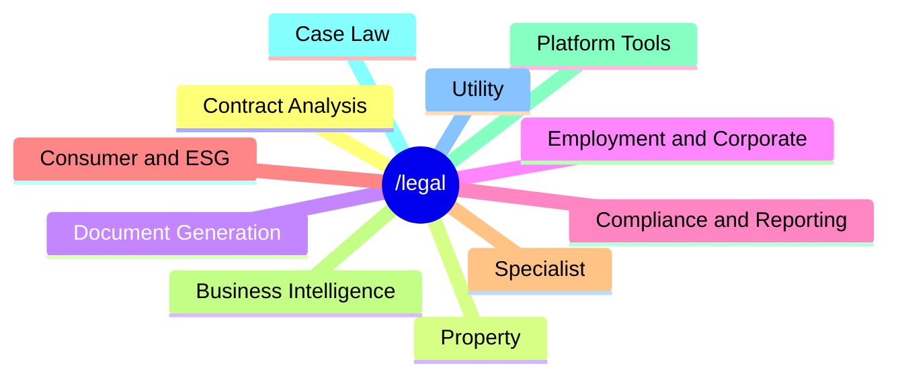

---

## 🗺️ System architecture

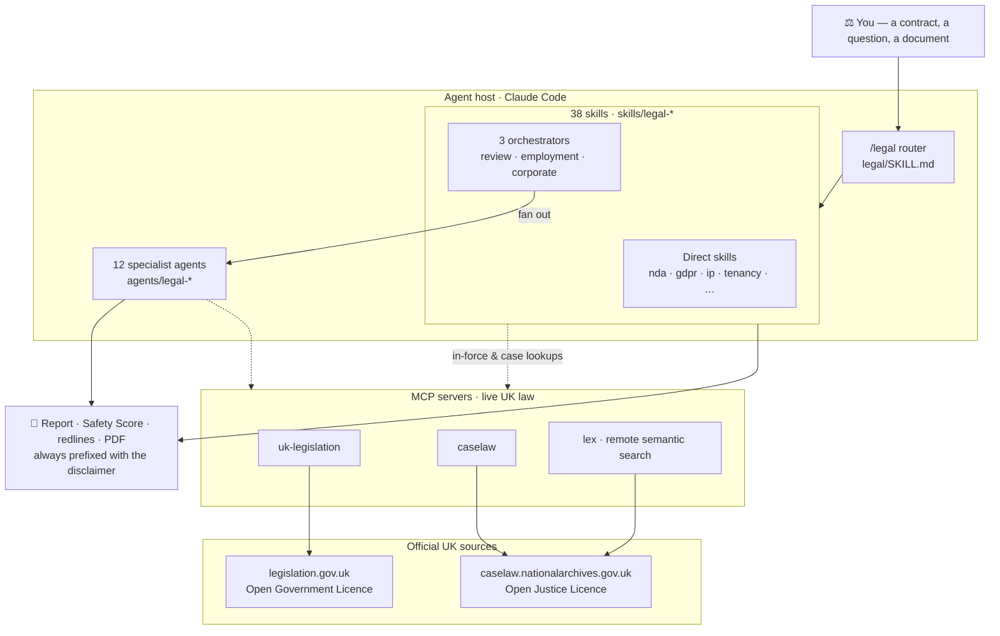

---

## ⚡ Quick start

You need [Claude Code](https://docs.claude.com/en/docs/claude-code). Then install the skills into `~/.claude/`:

```bash
# One-liner (clones this repo and installs)
curl -fsSL https://raw.githubusercontent.com/davendra/uk-legal-skills/main/install.sh | bash
```

…or from a local clone:

```bash
git clone https://github.com/davendra/uk-legal-skills.git
cd uk-legal-skills
./install.sh
```

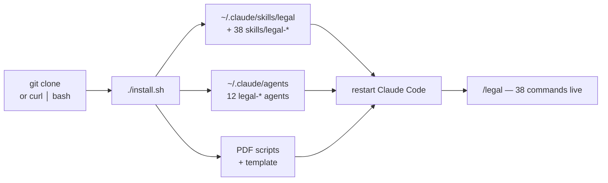

Then, inside Claude Code:

```
/legal                       # show the full command menu
/legal first-read nda.pdf    # 15-second triage: SIGN / NEGOTIATE / WALK
/legal review lease.docx     # full 5-agent review with a Safety Score
/legal caselaw "unfair dismissal whistleblowing"
```

Input is always one of three shapes: a **file path**, **pasted text**, or a **URL**. Remove everything with `./uninstall.sh`.

---

## 🧭 The 38 commands

| Command | What it does |
|---------|--------------|
| **🔎 Case Law** | |
| `/legal caselaw <query>` | Search 63,000+ UK judgments from Find Case Law by keyword, party, judge, statute section, or citation |
| **📃 Contract Analysis** | |
| `/legal first-read <file>` | Senior Counsel triage — a fast SIGN / NEGOTIATE / WALK verdict with a severity × likelihood matrix |
| `/legal review <file>` | **Flagship** — 5 parallel agents → a 0–100 Contract Safety Score, clause-by-clause analysis, prioritised fixes |
| `/legal risks <file>` | Deep risk scoring (1–10 per clause) with estimated GBP exposure and hidden-risk detection |
| `/legal compare <f1> <f2>` | Side-by-side diff of two versions, flagging dangerous changes with favourability analysis |
| `/legal plain <file>` | Translate every clause from legalese into plain English, with a glossary |
| `/legal negotiate <file>` | Counter-proposals with replacement language, talking points, and a ready-to-send email |
| `/legal missing <file>` | Find protections that *should* be in the contract but aren't, with insert-ready clauses |
| **🏠 Property** | |
| `/legal property <file>` | Leases, ASTs, commercial leases, transfers — Housing Act 1988, LTA 1954, Renters' Rights Act 2025 status, SDLT |
| `/legal tenancy <file>` | Tenancy review against Housing Act 1988, Tenant Fees Act 2019, and Renters' Rights Act 2025 with commencement checks |
| **✍️ Document Generation** | |
| `/legal nda <description>` | Generate a custom NDA — mutual, one-way, employee, or vendor |
| `/legal terms <url>` | Generate UK GDPR / PECR-compliant terms of service by scanning what the site does |
| `/legal privacy <url>` | Generate a privacy policy from detected data collection, referencing the ICO |
| `/legal agreement <type>` | Freelancer contracts, partnerships, SOWs, MSAs — with IR35-aware contractor provisions |
| `/legal freelancer <file>` | Review from the freelancer's perspective: contractor traps, IR35 indicators, restrictive covenants |
| **👔 Employment & Corporate** | |
| `/legal employment <file>` | Employment review — **4 parallel agents** against ERA 2025 reforms, Equality Act 2010, WTR 1998 |
| `/legal corporate <file>` | Corporate review — **3 parallel agents** against Companies Act 2006 and ECCTA 2023 |
| `/legal ir35 <file>` | IR35 status determination — 7-factor HMRC CEST-aligned assessment with a confidence score |
| `/legal aml <file>` | AML/KYC review against MLR 2017, POCA 2002, SAMLA 2018, and SRA obligations |
| **🛡️ Compliance & Reporting** | |
| `/legal compliance <url>` | Gap analysis across UK GDPR, DPA 2018, Equality Act 2010, PCI-DSS, PECR, Cyber Essentials |
| `/legal legislation-tracker <file>` | Scan for statutory references and flag outdated, amended, or repealed legislation |
| `/legal pre-launch <product>` | Forward-looking regulatory gate — Online Safety Act, UK GDPR, EU AI Act, FCA Consumer Duty, ICO Children's Code, ASA, PECR |
| `/legal report-pdf` | Client-ready A4 PDF with score gauges, risk charts, and a prioritised action checklist |
| **🛒 Consumer & ESG** | |
| `/legal consumer <file>` | Consumer compliance against CRA 2015, DMCCA 2024, CCR 2013, UCTA 1977 with CMA enforcement risk |
| `/legal esg <file>` | ESG review — Modern Slavery Act s.54 audit, UK SRS readiness, climate disclosure gaps |
| `/legal dispute <file>` | Dispute clauses — pre-action protocol, ADR enforceability, fixed recoverable costs, limitation tracker |
| **🎓 Specialist** | |
| `/legal gdpr <file>` | In-depth UK GDPR / DPA 2018 / PECR audit, including Data (Use and Access) Act 2025 status |
| `/legal ip <file>` | IP review — licences, assignments, trade marks, patents, CDPA 1988, AI-generated works |
| `/legal debt <file>` | Debt recovery — pre-action protocol, limitation, enforcement routes, Late Payment Act 1998 |
| `/legal immigration <file>` | Sponsor licence audits, Right to Work checks, Skilled Worker requirements, civil penalty exposure |
| `/legal wills <file>` | Wills & probate — Wills Act 1837 execution, IHT planning, Inheritance Act 1975 claim risk, LPAs |
| **📊 Business Intelligence** | |
| `/legal benchmark <file>` | Benchmark every clause against England & Wales market standards (80+ benchmarks, 14 contract types) |
| `/legal due-diligence <file>` | M&A due diligence — 60-item checklist across 8 categories |
| `/legal board-pack <details>` | Companies Act-compliant minutes, resolutions, declarations, appointments, dividends |
| `/legal regulatory-calendar` | 12-month filing calendar — Companies House, HMRC, ICO, FCA, SRA deadlines and penalties |
| `/legal matter-brief <matter>` | State-of-the-matter brief consolidating documents, prior reviews, deadlines, and next move |
| **🧰 Platform Tools** | |
| `/legal ai-compliance <file>` | AI compliance self-assessment for law firms — SRA Standards, UK AI principles, ICO guidance, EU AI Act |
| **🔧 Utility** | |
| `/legal fetch-samples` | Find and catalogue public UK legal sample documents for testing |

> The always-current, machine-readable catalogue is [`registry/skill-registry.json`](registry/skill-registry.json); it's rendered into [`doc-site/reference/all-commands.md`](doc-site/reference/all-commands.md) by `npm run docs:generate`.

---

## 🤖 Orchestrators & agents

Most skills run solo. Three are **orchestrators** that fan out to parallel specialist agents and then aggregate a **weighted** score — so the final verdict is a blend of independent expert passes, not a single opinion.

### `/legal review` — the flagship (5 agents)

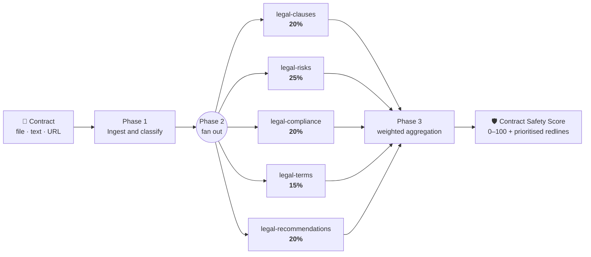

### `/legal employment` & `/legal corporate`

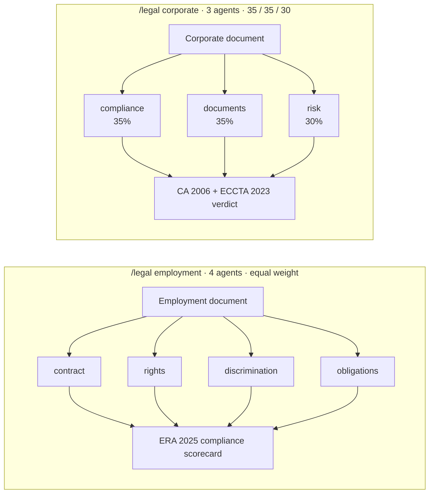

| Orchestrator | Agents | Weights |
|--------------|--------|---------|
| `/legal review` | `legal-clauses`, `legal-risks`, `legal-compliance`, `legal-terms`, `legal-recommendations` | 20 / 25 / 20 / 15 / 20 |
| `/legal employment` | `legal-employment-contract`, `-rights`, `-discrimination`, `-obligations` | equal |
| `/legal corporate` | `legal-corporate-compliance`, `-documents`, `-risk` | 35 / 35 / 30 |

The remaining agents in [`agents/`](agents/) back individual skills. Change a subagent's output contract and you must update the aggregation step in its parent orchestrator — the parity guard (`npm run test:skills`) keeps the whole graph honest.

---

## 🔄 How a review flows

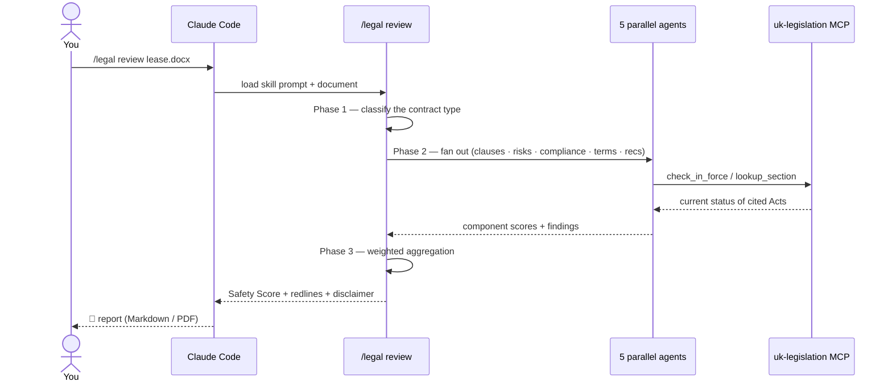

---

## 🧑‍💼 Business flows & who it's for

`UK Legal Skills` collapses a multi-step legal workflow into a guided path. The triage skill routes you to the right depth:

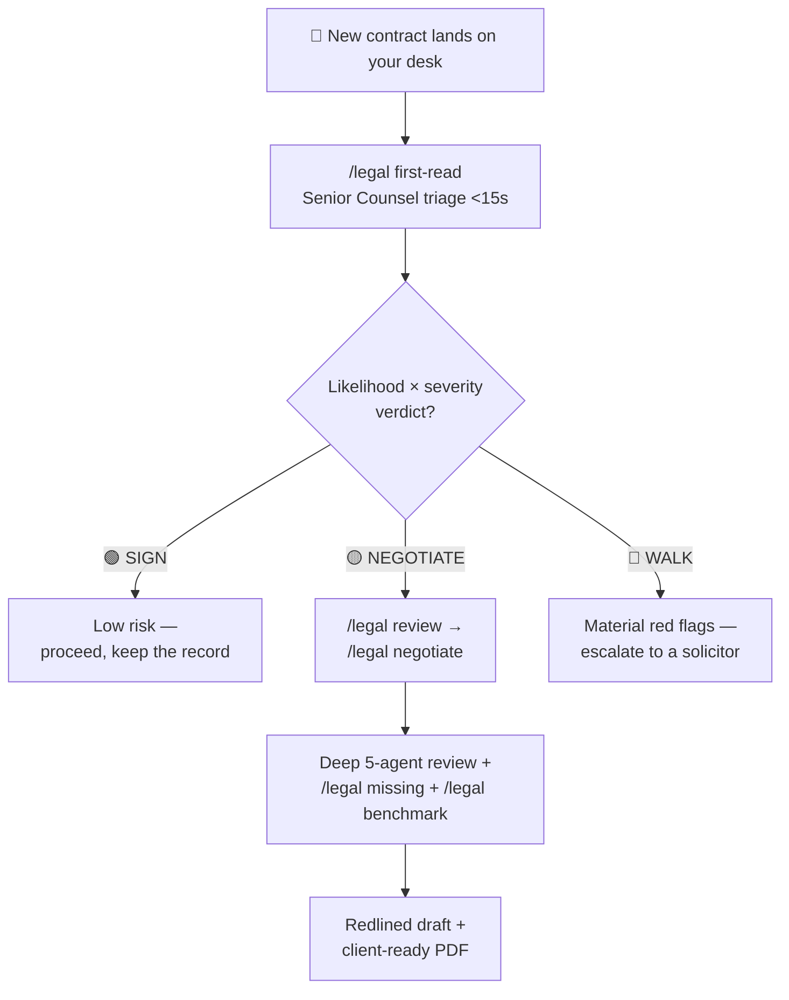

**A persona walk-through — a freelancer vetting a client contract:**

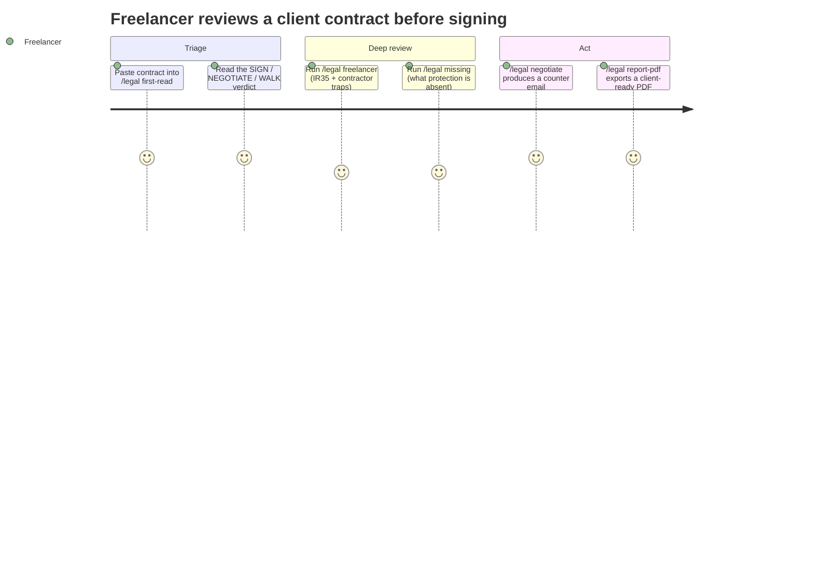

| Persona | Typical path |
|---------|--------------|
| 🧑‍💻 **Freelancer / contractor** | `first-read` → `freelancer` → `ir35` → `negotiate` |
| 🚀 **Startup founder** | `terms` / `privacy` (generate) → `gdpr` → `pre-launch` (regulatory gate) |
| 🏢 **In-house / ops** | `review` → `compliance` → `regulatory-calendar` → `board-pack` |
| 🏠 **Renter / landlord** | `tenancy` / `property` (with Renters' Rights Act 2025 commencement checks) |
| ⚖️ **Solicitor / paralegal** | `review` → `benchmark` → `due-diligence` → `caselaw` → `report-pdf` |

---

## 📡 Live UK legal data (MCP)

Skills that need current law call three [Model Context Protocol](https://modelcontextprotocol.io) servers, registered in [`.mcp.json`](.mcp.json):

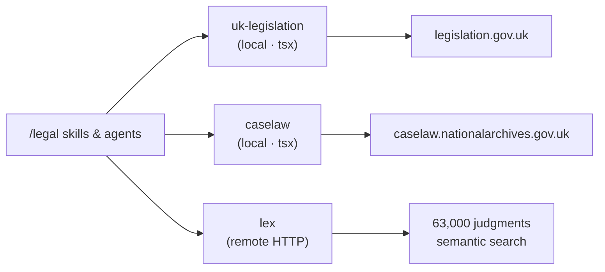

| Server | Source | Tools |
|--------|--------|-------|
| `uk-legislation` | legislation.gov.uk (OGL v3.0) | `search_legislation`, `lookup_statute`, `lookup_section`, `check_in_force`, `check_amendments`, `get_extent` |
| `caselaw` | caselaw.nationalarchives.gov.uk (Open Justice Licence) | `search_caselaw`, `lookup_judgment`, `summarise_judgment`, `get_judgments_for_section`, search-by-judge / party |
| `lex` | Remote HTTP, semantic search | Complements the local `caselaw` server |

The two local servers are TypeScript and need a one-time build (no API key — they query public government APIs):

```bash
cd mcp-servers/uk-legislation && npm install && npm run build
cd ../caselaw && npm install && npm run build
```

---

## ⚖️ Jurisdiction & legal currency

This suite is **England & Wales only**. Scots law and Northern Irish law are out of scope.

Post-2024 reforms are moving fast, so commencement-aware skills (`employment`, `tenancy`, `gdpr`, `consumer`, `corporate`, `legislation-tracker`, `pre-launch`) run a **live in-force check** before treating any reform as binding:

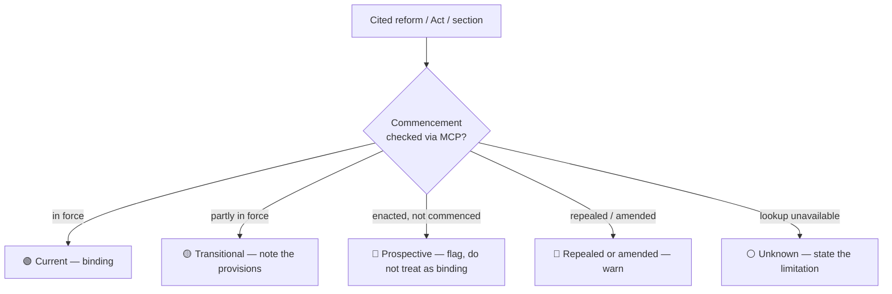

Risk is always reported with standardised indicators: 🔴 **High** · 🟡 **Medium** · 🟢 **Low**.

---

## 🚨 Escalation triggers

Every skill checks its own output for signals that need a human solicitor *now*, and prepends an escalation banner above the disclaimer when it finds one:

- ⚔️ Active litigation or pre-action correspondence (LBA, Part 36 offer, court order)
- 🏛️ Regulator action or enquiry (FCA, ICO, HMRC, SRA, CMA, Ofcom…)
- 🔓 Personal data breach (> 100 subjects, special-category, or children's data)
- ⚠️ Criminal liability (corporate manslaughter, ECCTA failure-to-prevent fraud, MLR/sanctions breaches)
- ⏳ Imminent limitation period (< 30 days)
- 👔 Director personal liability (wrongful trading, misfeasance, disqualification)
- 📣 Whistleblowing / PIDA-protected disclosure

---

## 🧱 How it works

Each skill is a **self-contained Markdown prompt** — no runtime, no SDK, no compiled code. The host agent reads the skill and runs it, using whatever capabilities the host provides (file reading, web fetch, subagents, MCP, PDF generation). That makes the skills:

- **Portable** — they run in Claude Code today, and any compatible agent host tomorrow.
- **Auditable** — the entire behaviour of a skill is the Markdown you can read in `skills/legal-*/SKILL.md`.
- **Forkable** — change a prompt, re-run the parity guard, ship.

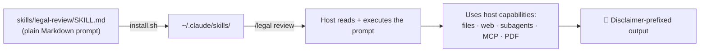

---

## 📂 Repository layout

```
uk-legal-skills/
├── legal/SKILL.md         # the /legal router — entry point + disclaimer
├── skills/legal-*/         # 38 self-contained skill prompts
├── agents/legal-*.md       # 12 subagent prompts (orchestrator workers + specialists)
├── mcp-servers/            # uk-legislation & caselaw MCP servers (TypeScript)
├── scripts/                # PDF generation, document ingestion, audit/parity scripts
├── templates/              # contract template copied into ~/.claude on install
├── registry/               # skill-registry.json — the canonical command catalogue
├── samples/                # synthetic sample documents for testing
├── evaluation/             # expected-findings corpus + scorer
├── doc-site/               # VitePress documentation site
├── install.sh / uninstall.sh
└── .mcp.json               # registers the three MCP servers
```

---

## 🧪 Development & tests

A small audit suite keeps the skills, agents, router, registry, and docs in lockstep (Node 18+):

```bash
npm run test:skills        # 38-skill ↔ 12-agent ↔ router ↔ registry parity guard
npm run test:docs          # regenerates the command reference and checks docs parity
npm run test:evaluations   # validates the expected-findings eval corpus
npm run docs:generate      # rebuild the command reference from the registry
```

The MCP servers carry their own `node --test` suites:

```bash
cd mcp-servers/uk-legislation && npm test   # 5 tests
cd mcp-servers/caselaw && npm test          # 9 tests
```

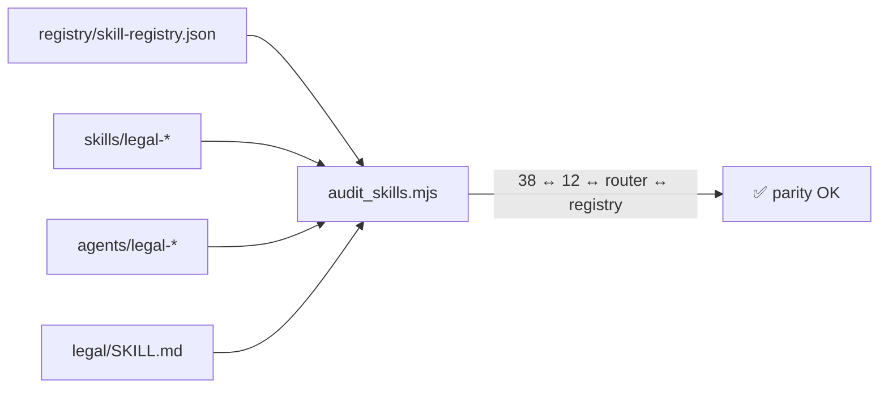

---

## 💻 Examples

```bash
# Triage before a deep review
/legal first-read services-agreement.pdf

# Full flagship review of a commercial lease (5 agents → Safety Score)
/legal review commercial-lease.docx

# Compare two NDA drafts and flag dangerous changes
/legal compare nda-v1.docx nda-v2.docx

# Generate a UK GDPR / PECR-compliant privacy policy from a live site
/legal privacy https://example.co.uk

# Determine IR35 status of a contractor agreement
/legal ir35 contractor-agreement.pdf

# Search case law on a point of employment law
/legal caselaw "constructive dismissal implied term of trust and confidence"

# Turn the latest review into a client-ready PDF
/legal report-pdf
```

A typical `/legal review` opens like this (every output starts with the disclaimer):

```text
AI-Generated Legal Analysis — This output is produced by AI and does not constitute legal advice. …

🛡️ Contract Safety Score: 64 / 100  (Medium risk)

🔴 High-risk clauses (3)   🟡 Medium (7)   🟢 Low (12)
1. 🔴 Clause 14.2 — Uncapped indemnity. Estimated exposure: £—. Suggested replacement: …
```

---

## 🌐 Hosted version — The Counsel

Prefer a polished web app to the terminal? **[The Counsel](https://the-counsel.co.uk)** is a hosted product built on these same skills — document upload, live streaming analysis, audio briefings, tracked-changes export, and matter management in the browser.

This repository is the open-source **skills engine**; The Counsel is a separate, independently deployed product. Use whichever fits your workflow.

---

## ❓ FAQ

<details>
<summary><b>Do I need an API key?</b></summary>

Not for the `/legal` commands — the agent host (Claude Code) provides model access. The MCP servers also need no key; they query public government APIs.
</details>

<details>
<summary><b>Is this legal advice?</b></summary>

No. It's AI-generated analysis and drafting to use as a starting point. Always have a qualified solicitor review before you sign or rely on anything. See the [disclaimer](#-disclaimer).
</details>

<details>
<summary><b>Does it cover Scotland or Northern Ireland?</b></summary>

No — England & Wales only, by design. The statutes, section numbers, and market standards are all E&W-specific.
</details>

<details>
<summary><b>How does it stay up to date with new legislation?</b></summary>

Commencement-aware skills run live in-force checks through the legislation MCP server before treating a reform as binding, and classify provisions as current, transitional, prospective, repealed, or unknown.
</details>

<details>
<summary><b>Can I add my own skill?</b></summary>

Yes — see [CONTRIBUTING.md](CONTRIBUTING.md). Add a `SKILL.md`, wire it into the router and `registry/skill-registry.json`, and run `npm run test:skills`.
</details>

---

## 🤝 Contributing

Contributions are welcome — new skills, agent improvements, MCP tooling, sample documents, and docs. Start with [CONTRIBUTING.md](CONTRIBUTING.md).

The golden rules: **England & Wales only**, every output starts with the disclaimer block, risk indicators are 🔴/🟡/🟢, and the parity guard must pass.

---

## 📚 Data sources & licences

- **Legislation** — [legislation.gov.uk](https://www.legislation.gov.uk) under the [Open Government Licence v3.0](https://www.nationalarchives.gov.uk/doc/open-government-licence/version/3/).
- **Case law** — [Find Case Law, The National Archives](https://caselaw.nationalarchives.gov.uk) under the [Open Justice Licence](https://caselaw.nationalarchives.gov.uk/open-justice-licence).

This project is not affiliated with or endorsed by HM Government, HM Courts & Tribunals Service, or The National Archives.

---

## 📜 Disclaimer

```
AI-Generated Legal Analysis — This output is produced by AI and does not constitute legal advice.
It is intended as a starting point for review. Always consult a qualified solicitor before
signing contracts or relying on generated legal documents. This tool is designed for use
under the laws of England and Wales.
```

---

## 📄 License

[MIT](LICENSE) — use it commercially, fork it, build on it. Attribution appreciated.

<div align="center">

**Built for England & Wales. Not legal advice.**

If this saved you time, a ⭐ helps others find it.

</div>
