<p align="center">
  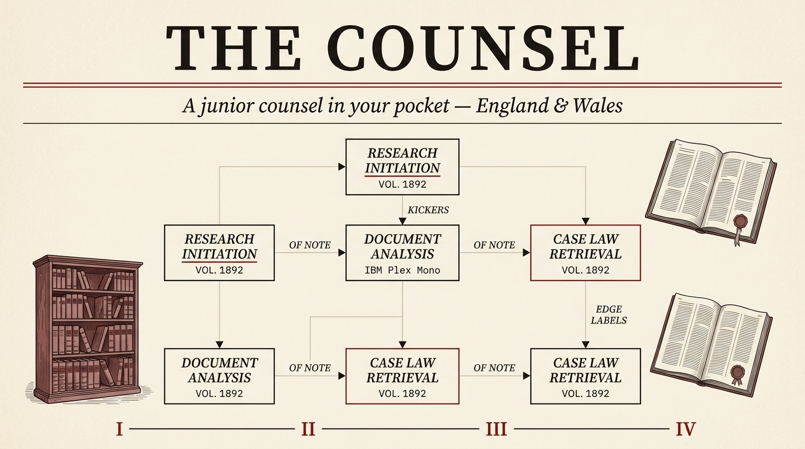
</p>

<h1 align="center">UK Legal Skills</h1>

<p align="center">
  <em>A junior counsel in your pocket.</em><br>
  Thirty-eight legal skills, twelve agents, and the entirety of England &amp; Wales statute and case law — assembled into a single quiet assistant for <a href="https://claude.com/claude-code">Claude Code</a>, run as <code>/legal</code> commands.
</p>

<p align="center">
  <a href="LICENSE.md"></a>
  <a href="registry/skill-registry.json"></a>
  <a href="agents/"></a>
  <a href=".mcp.json"></a>
  <a href="#-jurisdiction--legal-currency"></a>
  <a href="https://ailegal.the-counsel.co.uk"></a>
  <a href="https://claude.com/claude-code"></a>
</p>

<p align="center">
  <a href="https://ailegal.the-counsel.co.uk"><b>📖 Documentation</b></a> ·
  <a href="#-quick-start"><b>⚡ Quick start</b></a> ·
  <a href="#-the-38-commands"><b>🧭 Commands</b></a> ·
  <a href="https://the-counsel.co.uk"><b>🌐 Hosted version</b></a>
</p>

> [!WARNING]
> **Not legal advice.** Everything here is AI-generated legal *analysis* and *drafting*, intended as a starting point. It is **not** a substitute for a qualified solicitor, and it covers **England & Wales only**. Always have a solicitor review before you sign a contract or rely on a generated document.

---

## The principle

> *In the matter of any contract before you, the question is rarely* **what does the document say**. *It is what the document* **does** — *to your money, your obligations, and the next twenty years of your professional life.*

**Specialist before general. Fact before form.** UK Legal Skills is built around how solicitors actually reason — not how chatbots usually answer. Each skill is grounded in a specific corner of England & Wales law, with the precise statute in the margin and a live check that the law it relies on is the law in force *this morning*.

---

## 📑 Contents

- [Quick start](#-quick-start)
- [The first read](#-the-first-read)
- [The 38 commands](#-the-38-commands)
- [The panel — orchestrators & agents](#-the-panel--orchestrators--agents)
- [System architecture](#-system-architecture)
- [Jurisdiction & legal currency](#-jurisdiction--legal-currency)
- [Live UK legal data (MCP)](#-live-uk-legal-data-mcp)
- [Risk scoring](#-risk-scoring)
- [Who it's for](#-who-its-for)
- [How it works](#-how-it-works)
- [Repository layout](#-repository-layout)
- [Development & tests](#-development--tests)
- [Hosted version — The Counsel](#-hosted-version--the-counsel)
- [FAQ](#-faq)
- [Contributing](#-contributing)
- [Data sources & licences](#-data-sources--licences)
- [Licence](#-licence)

---

## ⚡ Quick start

You need [Claude Code](https://docs.claude.com/en/docs/claude-code). Install the skills into `~/.claude/`:

```bash
# One-liner — clones this repo and installs
curl -fsSL https://raw.githubusercontent.com/davendra/uk-legal-skills/main/install.sh | bash
```

…or from a local clone:

```bash
git clone https://github.com/davendra/uk-legal-skills.git
cd uk-legal-skills
./install.sh
```

`install.sh` copies the `/legal` router, all **38 skills**, **12 agents**, the PDF/ingestion scripts, and the contract template into `~/.claude/`. Restart Claude Code, then:

```
/legal                       # the full command menu
/legal first-read nda.pdf    # 15-second triage: SIGN / NEGOTIATE / WALK
/legal review lease.docx     # full 5-agent review with a Safety Score
/legal caselaw "unfair dismissal whistleblowing"
```

Input is always one of three shapes — a **file path**, **pasted text**, or a **URL**. Remove everything with `./uninstall.sh`.

<p align="center">
  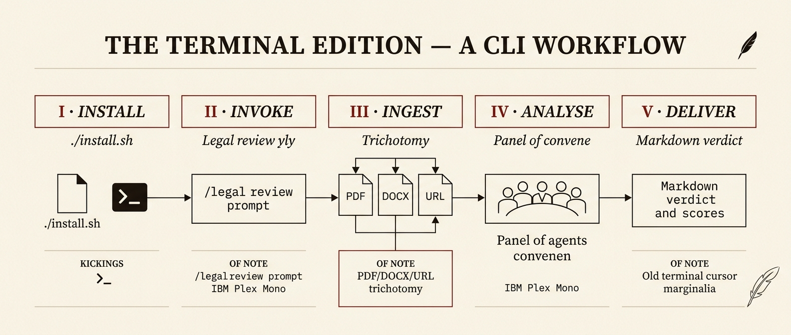
  <br><sub><em>Plate I — install, invoke, ingest, analyse, deliver.</em></sub>
</p>

---

## ⚖️ The first read

Most everyday legal work is *triage*: spotting the dangerous clause, the missing protection, the out-of-date statute. `/legal first-read` gives a Senior Counsel verdict in under fifteen seconds — **SIGN**, **NEGOTIATE**, or **WALK** — on a likelihood × severity matrix, then routes anything red to the deep five-agent review.

<p align="center">
  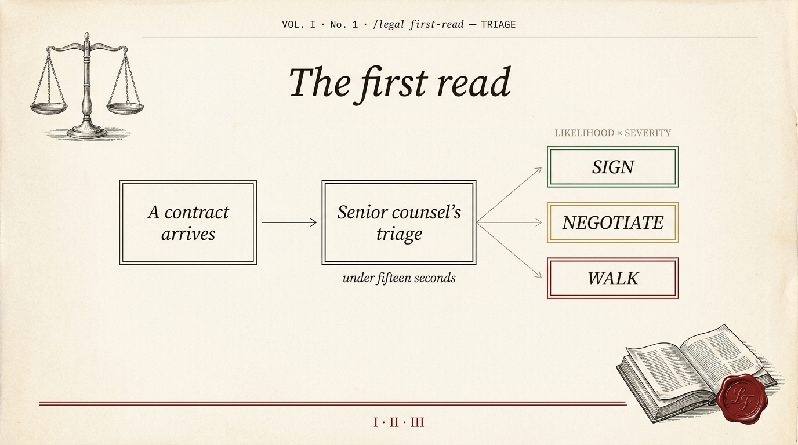
  <br><sub><em>Plate II — the first read: a verdict before the deep review. <code>contract → triage → SIGN · NEGOTIATE · WALK</code>.</em></sub>
</p>

---

## 🧭 The 38 commands

Thirty-eight specialists, each one fluent in a single corner of England & Wales law. Invoke any with the `/legal` prefix.

<p align="center">
  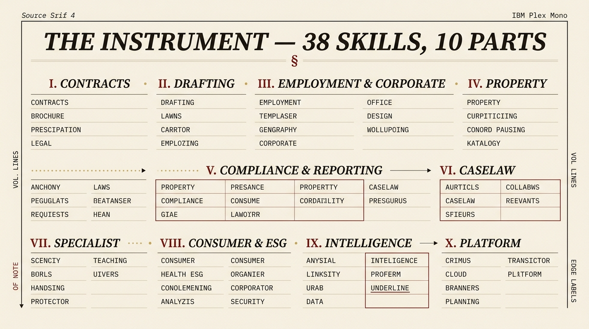
  <br><sub><em>Plate III — the instrument: thirty-eight skills, grouped by field.</em></sub>
</p>

| Command | What it does |
|---------|--------------|
| **🔎 Case Law** | |
| `/legal caselaw <query>` | Search 63,000+ UK judgments from Find Case Law (National Archives) by keyword, party, judge, statute section, or citation |
| **📃 Contract Analysis** | |
| `/legal first-read <file>` | Senior Counsel triage — a fast (<15s) SIGN / NEGOTIATE / WALK verdict with a severity × likelihood matrix |
| `/legal review <file>` | **Flagship** — 5 parallel agents → a 0–100 Contract Safety Score, clause-by-clause analysis, prioritised fixes |
| `/legal risks <file>` | Deep risk scoring (1–10 per clause) with estimated GBP exposure and hidden-risk detection |
| `/legal compare <file1> <file2>` | Side-by-side diff of two versions, flagging dangerous changes with favourability analysis |
| `/legal plain <file>` | Translate every clause from legalese into plain English, with a glossary |
| `/legal negotiate <file>` | Counter-proposals with replacement language, talking points, and a ready-to-send email |
| `/legal missing <file>` | Find protections that *should* be in the contract but aren't, with insert-ready clauses |
| **🏠 Property** | |
| `/legal property <file>` | Leases, ASTs, commercial leases, transfers — Housing Act 1988, LTA 1954, Renters' Rights Act 2025 status, SDLT |
| `/legal tenancy <file>` | Tenancy review against Housing Act 1988, Tenant Fees Act 2019, and Renters' Rights Act 2025 with commencement checks |
| **✍️ Document Generation** | |
| `/legal nda <description>` | Generate a custom NDA — mutual, one-way, employee, or vendor |
| `/legal terms <url>` | Generate UK GDPR / PECR-compliant terms of service by scanning what the site does |
| `/legal privacy <url>` | Generate a privacy policy from detected data collection, referencing the ICO |
| `/legal agreement <type>` | Freelancer contracts, partnerships, SOWs, MSAs — with IR35-aware contractor provisions |
| `/legal freelancer <file>` | Review from the freelancer's perspective: contractor traps, IR35 indicators, restrictive covenants |
| **👔 Employment & Corporate** | |
| `/legal employment <file>` | Employment review — **4 parallel agents** against ERA 2025 reforms, Equality Act 2010, WTR 1998 |
| `/legal corporate <file>` | Corporate review — **3 parallel agents** against Companies Act 2006 and ECCTA 2023 |
| `/legal ir35 <file>` | IR35 status determination — 7-factor HMRC CEST-aligned assessment with a confidence score |
| `/legal aml <file>` | AML/KYC review against MLR 2017, POCA 2002, SAMLA 2018, and SRA obligations |
| **🛡️ Compliance & Reporting** | |
| `/legal compliance <url>` | Gap analysis across UK GDPR, DPA 2018, Equality Act 2010, PCI-DSS, PECR, Cyber Essentials |
| `/legal legislation-tracker <file>` | Scan for statutory references and flag outdated, amended, or repealed legislation |
| `/legal pre-launch <product>` | Forward-looking regulatory gate — Online Safety Act, UK GDPR, EU AI Act, FCA Consumer Duty, ICO Children's Code, ASA, PECR |
| `/legal report-pdf` | Client-ready A4 PDF with score gauges, risk charts, and a prioritised action checklist |
| **🛒 Consumer & ESG** | |
| `/legal consumer <file>` | Consumer compliance against CRA 2015, DMCCA 2024, CCR 2013, UCTA 1977 with CMA enforcement risk |
| `/legal esg <file>` | ESG review — Modern Slavery Act s.54 audit, UK SRS readiness, climate disclosure gaps |
| `/legal dispute <file>` | Dispute clauses — pre-action protocol, ADR enforceability, fixed recoverable costs, limitation tracker |
| **🎓 Specialist** | |
| `/legal gdpr <file>` | In-depth UK GDPR / DPA 2018 / PECR audit, including Data (Use and Access) Act 2025 status |
| `/legal ip <file>` | IP review — licences, assignments, trade marks, patents, CDPA 1988, AI-generated works |
| `/legal debt <file>` | Debt recovery — pre-action protocol, limitation, enforcement routes, Late Payment Act 1998 |
| `/legal immigration <file>` | Sponsor licence audits, Right to Work checks, Skilled Worker requirements, civil penalty exposure |
| `/legal wills <file>` | Wills & probate — Wills Act 1837 execution, IHT planning, Inheritance Act 1975 claim risk, LPAs |
| **📊 Business Intelligence** | |
| `/legal benchmark <file>` | Benchmark every clause against England & Wales market standards (80+ benchmarks, 14 contract types) |
| `/legal due-diligence <file>` | M&A due diligence — 60-item checklist across 8 categories |
| `/legal board-pack <details>` | Companies Act-compliant minutes, resolutions, declarations, appointments, dividends |
| `/legal regulatory-calendar` | 12-month filing calendar — Companies House, HMRC, ICO, FCA, SRA deadlines and penalties |
| `/legal matter-brief <matter>` | State-of-the-matter brief consolidating documents, prior reviews, deadlines, and next move |
| **🧰 Platform Tools** | |
| `/legal ai-compliance <file>` | AI compliance self-assessment for law firms — SRA Standards, UK AI principles, ICO guidance, EU AI Act |
| **🔧 Utility** | |
| `/legal fetch-samples` | Find and catalogue public UK legal sample documents for testing |

> The always-current, machine-readable catalogue is [`registry/skill-registry.json`](registry/skill-registry.json), rendered into the [full command reference](https://ailegal.the-counsel.co.uk/reference/all-commands).

---

## 🏛️ The panel — orchestrators & agents

Most skills run solo. Three are **orchestrators** that fan out to parallel specialist agents and then aggregate a **weighted** score — so the verdict is a blend of independent expert passes, not a single opinion.

<p align="center">
  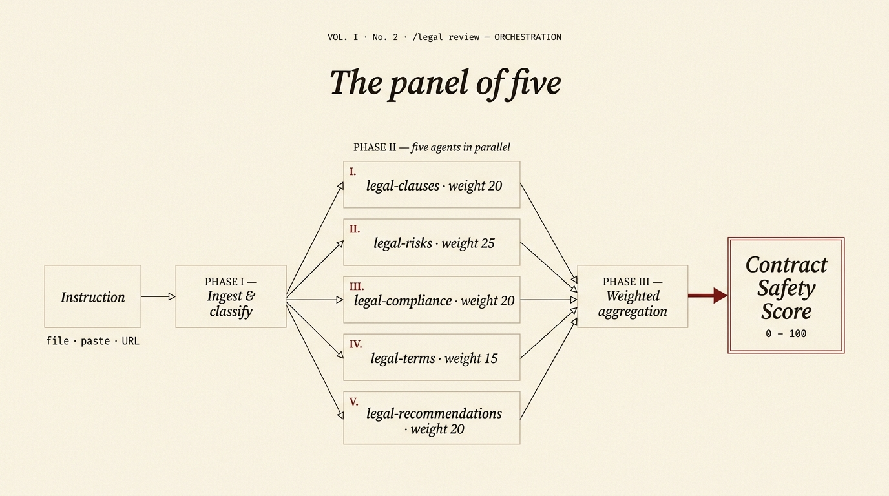
  <br><sub><em>Plate IV — the panel of five: <code>/legal review</code> aggregates to a Contract Safety Score.</em></sub>
</p>

<p align="center">
  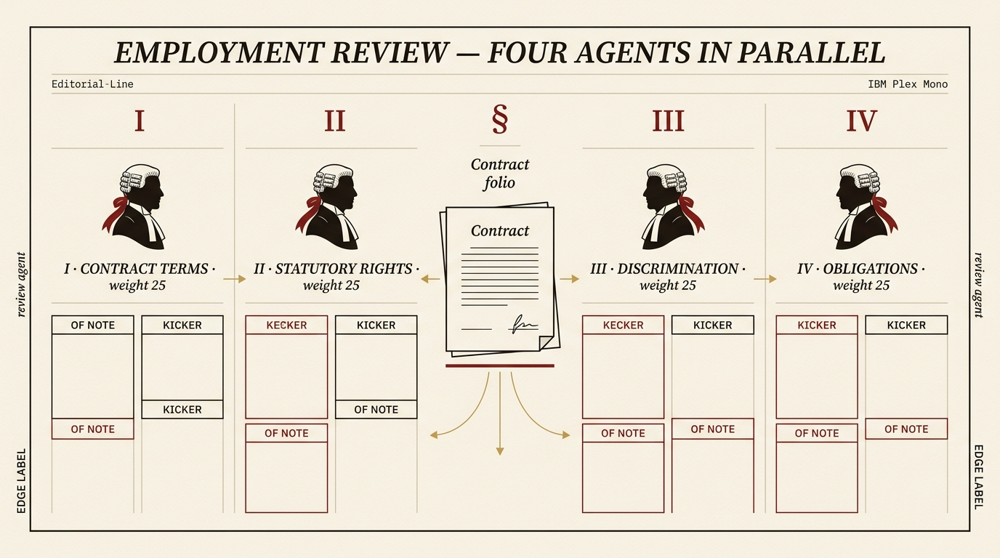
  <br><sub><em>Plate V — <code>/legal employment</code>: four agents in parallel against ERA 2025.</em></sub>
</p>

| Orchestrator | Agents | Weights |
|--------------|--------|---------|
| `/legal review` | `legal-clauses`, `legal-risks`, `legal-compliance`, `legal-terms`, `legal-recommendations` | 20 / 25 / 20 / 15 / 20 |
| `/legal employment` | `legal-employment-contract`, `-rights`, `-discrimination`, `-obligations` | equal |
| `/legal corporate` | `legal-corporate-compliance`, `-documents`, `-risk` | 35 / 35 / 30 |

The remaining agents in [`agents/`](agents/) back individual skills. Change a subagent's output contract and you must update its parent orchestrator — the parity guard (`npm run test:skills`) keeps the whole graph honest.

---

## 🗺️ System architecture

```
You → /legal router → 38 skills → (3 orchestrators fan out to 12 agents) → MCP servers → official UK sources → report
```

<p align="center">
  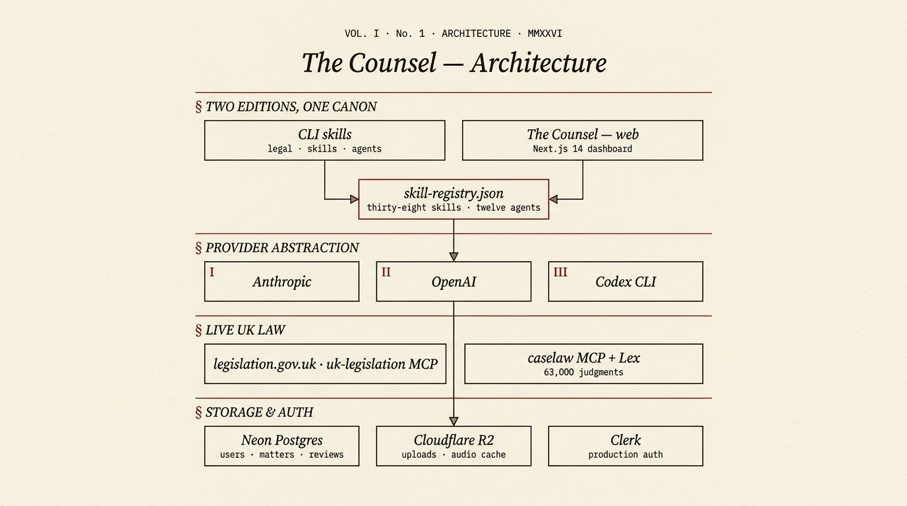
  <br><sub><em>Plate VI — the chambers: skills, agents, and live UK law, one canon.</em></sub>
</p>

Each skill is a **self-contained Markdown prompt** — no runtime, no SDK, no API key. The host agent reads the skill and runs it using its own capabilities (file reading, web fetch, subagents, MCP, PDF). That makes the skills portable, auditable, and easy to fork.

---

## ⚖️ Jurisdiction & legal currency

This suite is **England & Wales only**. Scots law and Northern Irish law are out of scope.

Post-2024 reforms move fast, so commencement-aware skills (`employment`, `tenancy`, `gdpr`, `consumer`, `corporate`, `legislation-tracker`, `pre-launch`) run a **live in-force check** before treating any reform as binding — classifying every cited provision as current, transitional, prospective, repealed, or unknown.

<p align="center">
  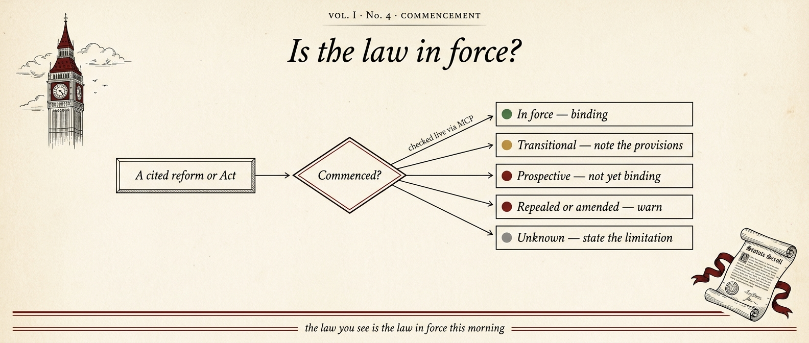
  <br><sub><em>Plate VII — is the law in force? Commencement checked live via MCP, every analysis.</em></sub>
</p>

Risk is always reported with standardised indicators: 🔴 **High** · 🟡 **Medium** · 🟢 **Low**.

---

## 📡 Live UK legal data (MCP)

Skills that need current law call three [Model Context Protocol](https://modelcontextprotocol.io) servers, registered in [`.mcp.json`](.mcp.json):

<p align="center">
  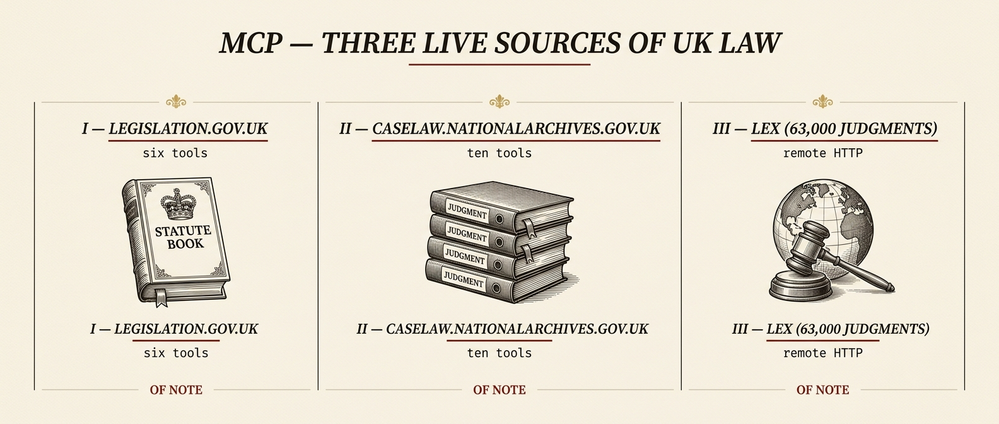
  <br><sub><em>Plate VIII — three live sources of UK law.</em></sub>
</p>

| Server | Source | Tools |
|--------|--------|-------|
| `uk-legislation` | legislation.gov.uk (OGL v3.0) | `search_legislation`, `lookup_statute`, `lookup_section`, `check_in_force`, `check_amendments`, `get_extent` |
| `caselaw` | caselaw.nationalarchives.gov.uk (Open Justice Licence) | `search_caselaw`, `lookup_judgment`, `summarise_judgment`, `get_judgments_for_section`, search-by-judge / party |
| `lex` | Remote HTTP, semantic search over 63,000 judgments | complements the local `caselaw` server |

The two local servers are TypeScript and need a one-time build (no API key — they query public government APIs):

```bash
cd mcp-servers/uk-legislation && npm install && npm run build
cd ../caselaw && npm install && npm run build
```

---

## 📊 Risk scoring

Every finding carries a standardised severity, and the flagship review aggregates them into a single 0–100 **Contract Safety Score** — written the way solicitors read, with the precise statute in the margin.

<p align="center">
  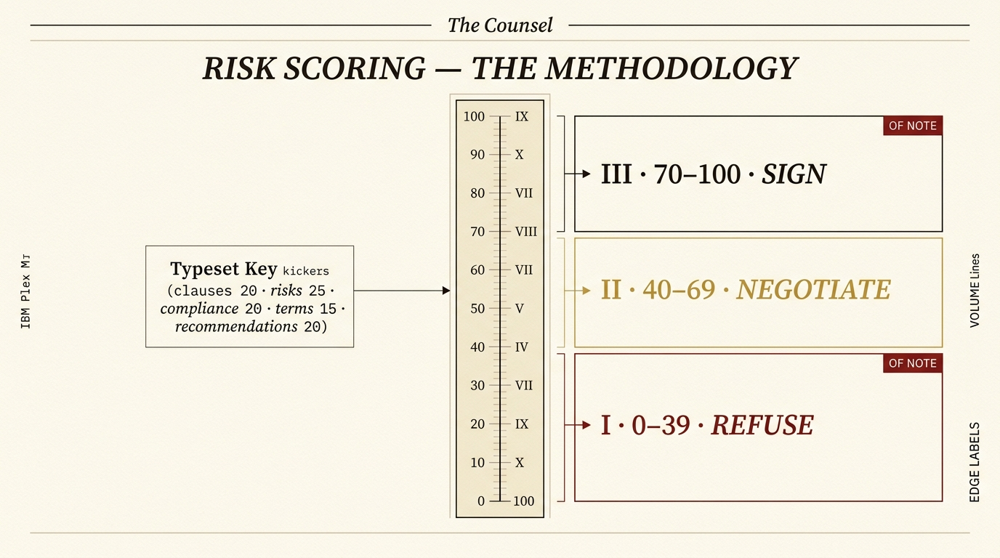
  <br><sub><em>Plate IX — the risk methodology, from safe to refuse-to-sign.</em></sub>
</p>

---

## 🧑‍💼 Who it's for

- 🧑‍💻 **Freelancers & contractors** — check contracts for IR35 traps, unfair terms, and missing protections before you sign · `first-read → freelancer → ir35 → negotiate`
- 🏢 **Small business owners** — review supplier contracts, generate NDAs, audit UK GDPR compliance · `review → compliance → terms`
- 🏠 **Property professionals** — analyse leases and tenancies against the Renters' Rights Act 2025 · `property → tenancy`
- ⚖️ **In-house legal teams** — a first-pass triage tool so solicitors focus on what matters · `review → benchmark → due-diligence → report-pdf`
- 👩‍💻 **Developers & legal tech** — extend with new skills or wire the MCP servers into your own apps · see [Contributing](CONTRIBUTING.md)

---

## 🧱 How it works

A skill is just Markdown the host reads and executes — portable, auditable, forkable. There is no compiled code and no key baked in.

<p align="center">
  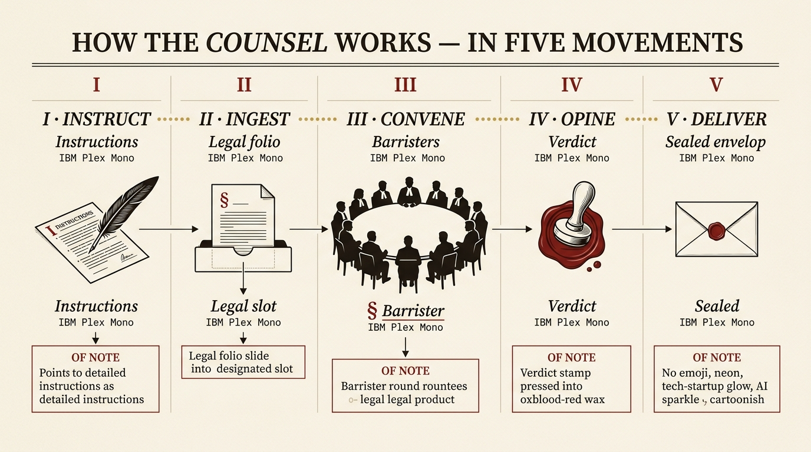
  <br><sub><em>Plate X — a skill is Markdown your agent host reads and runs.</em></sub>
</p>

---

## 📂 Repository layout

```
uk-legal-skills/
├── legal/SKILL.md         # the /legal router — entry point + disclaimer
├── skills/legal-*/         # 38 self-contained skill prompts
├── agents/legal-*.md       # 12 subagent prompts (orchestrator workers + specialists)
├── mcp-servers/            # uk-legislation & caselaw MCP servers (TypeScript)
├── scripts/                # PDF generation, document ingestion, audit/parity scripts
├── templates/              # contract template copied into ~/.claude on install
├── registry/               # skill-registry.json — the canonical command catalogue
├── samples/                # synthetic sample documents for testing
├── evaluation/             # expected-findings corpus + scorer
├── doc-site/               # VitePress documentation site (ailegal.the-counsel.co.uk)
└── install.sh / uninstall.sh
```

---

## 🧪 Development & tests

A small audit suite keeps skills, agents, router, registry, and docs in lockstep (Node 18+):

```bash
npm run test:skills        # 38-skill ↔ 12-agent ↔ router ↔ registry parity guard
npm run test:docs          # regenerate the command reference and check docs parity
npm run test:evaluations   # validate the expected-findings eval corpus
npm run docs:generate      # rebuild the command reference from the registry
```

The MCP servers carry their own `node --test` suites (`cd mcp-servers/<server> && npm test`).

<p align="center">
  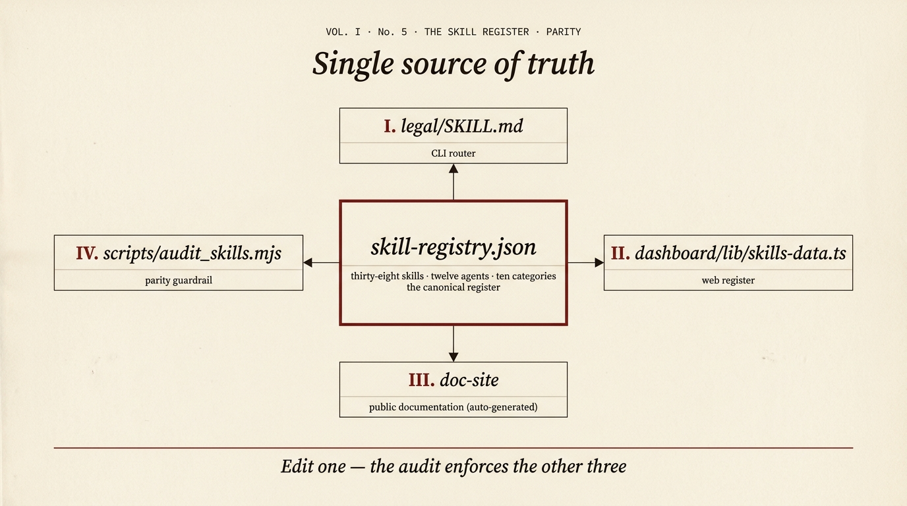
  <br><sub><em>Plate XI — one registry, several consumers, one audit. The single source of truth.</em></sub>
</p>

---

## 🌐 Hosted version — The Counsel

Prefer a polished web app to the terminal? **[The Counsel](https://the-counsel.co.uk)** is a hosted product built on these same skills — document upload, live streaming analysis, audio briefings, tracked-changes export, and matter management in the browser.

This repository is the source-available **skills engine**; The Counsel is a separate, independently deployed product. Use whichever fits your workflow.

---

## ❓ FAQ

<details>
<summary><b>Do I need an API key?</b></summary>

Not for the `/legal` commands — the agent host (Claude Code) provides model access. The MCP servers also need no key; they query public government APIs.
</details>

<details>
<summary><b>Is this legal advice?</b></summary>

No. It's AI-generated analysis and drafting to use as a starting point. Always have a qualified solicitor review before you sign or rely on anything.
</details>

<details>
<summary><b>Does it cover Scotland or Northern Ireland?</b></summary>

No — England & Wales only, by design. The statutes, section numbers, and market standards are all E&W-specific.
</details>

<details>
<summary><b>How does it stay current with new legislation?</b></summary>

Commencement-aware skills run live in-force checks through the legislation MCP server before treating a reform as binding — see <a href="#-jurisdiction--legal-currency">Jurisdiction & legal currency</a>.
</details>

<details>
<summary><b>Can I add my own skill?</b></summary>

Yes — see <a href="CONTRIBUTING.md">CONTRIBUTING.md</a>. Add a <code>SKILL.md</code>, wire it into the router and <code>registry/skill-registry.json</code>, and run <code>npm run test:skills</code>.
</details>

---

## 🤝 Contributing

Contributions are welcome — new skills, agent improvements, MCP tooling, sample documents, and docs. Start with [CONTRIBUTING.md](CONTRIBUTING.md).

The golden rules: **England & Wales only**, every output starts with the disclaimer block, risk indicators are 🔴/🟡/🟢, and the parity guard must pass.

<p align="center">
  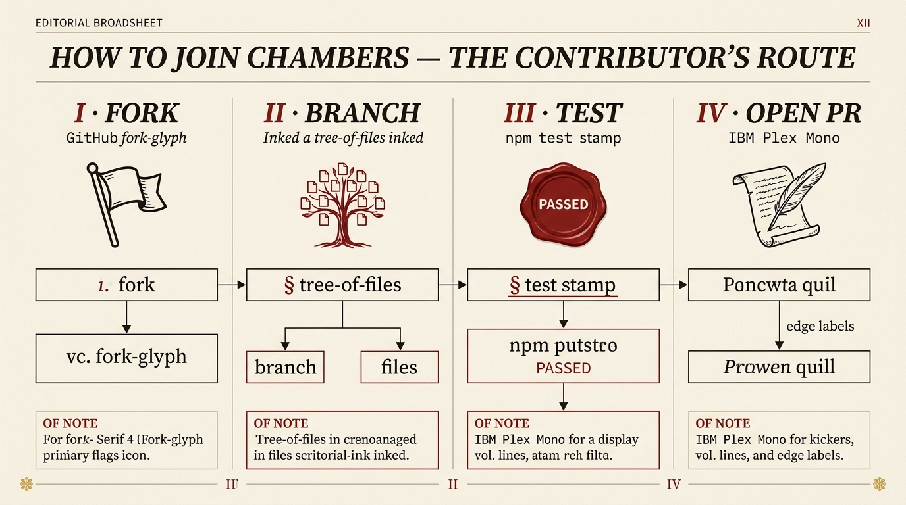
  <br><sub><em>Plate XII — fork, branch, test, open a pull request.</em></sub>
</p>

---

## 📚 Data sources & licences

- **Legislation** — [legislation.gov.uk](https://www.legislation.gov.uk) under the [Open Government Licence v3.0](https://www.nationalarchives.gov.uk/doc/open-government-licence/version/3/).
- **Case law** — [Find Case Law, The National Archives](https://caselaw.nationalarchives.gov.uk) under the [Open Justice Licence](https://caselaw.nationalarchives.gov.uk/open-justice-licence).

Not affiliated with or endorsed by HM Government, HM Courts & Tribunals Service, or The National Archives.

---

## 📜 Disclaimer

```
AI-Generated Legal Analysis — This output is produced by AI and does not constitute legal advice.
It is intended as a starting point for review. Always consult a qualified solicitor before
signing contracts or relying on generated legal documents. This tool is designed for use
under the laws of England and Wales.
```

---

## 📄 Licence

**Source-available** under the [Functional Source License (FSL-1.1-Apache-2.0)](LICENSE.md): use it inside your firm or business, for research, and when serving your own clients; fork and modify freely. You may **not** repackage it as a competing product or hosted service — that needs a [commercial licence](LICENSE.md#commercial-licensing). Each release converts to Apache 2.0 two years after its date.

<p align="center">
  <sub><em>UK Legal Skills — Established MMXXVI · Built for England &amp; Wales · Not legal advice.</em></sub>
  <br><br>
  If this saved you time, a ⭐ helps others find it.
</p>
