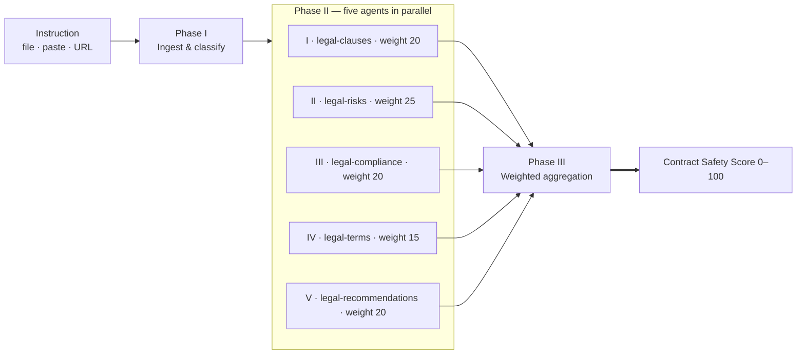

# Agent Orchestration

Agents are specialised analysis sub-tasks that run in parallel for deeper, multi-perspective document analysis. They are used by three orchestrator skills to divide complex legal analysis across focused domains.


*Plate I — the broadsheet rebrand.*


*Plate I.a — the original, kept for reference.*

## `/legal review` — the orchestration in detail

The flagship orchestrator runs as three phases: ingest, fan-out, aggregate.


::: details Mermaid source — the diagram above is generated from this



:::

## Agent Files

All 12 agents live in the `agents/` directory:

```
agents/
├── legal-clauses.md                    — Clause analysis (contract review)
├── legal-risks.md                      — Risk assessment (contract review)
├── legal-compliance.md                 — Compliance check (contract review)
├── legal-terms.md                      — Terms analysis (contract review)
├── legal-recommendations.md            — Recommendations (contract review)
├── legal-employment-contract.md        — Contract review (employment)
├── legal-employment-rights.md          — Employment rights (employment)
├── legal-employment-discrimination.md  — Discrimination scan (employment)
├── legal-employment-obligations.md     — Obligations map (employment)
├── legal-corporate-compliance.md       — Compliance (corporate)
├── legal-corporate-documents.md        — Documents (corporate)
└── legal-corporate-risk.md             — Risk (corporate)
```

## Orchestrator-Agent Relationships

### Contract Review (`/legal review`)

The flagship skill launches **5 parallel agents**:

```
legal-review/SKILL.md (orchestrator)
    ├── agents/legal-clauses.md          (20% weight)
    ├── agents/legal-risks.md            (25% weight)
    ├── agents/legal-compliance.md       (20% weight)
    ├── agents/legal-terms.md            (15% weight)
    └── agents/legal-recommendations.md  (20% weight)
```

The orchestrator ingests and classifies the contract in Phase 1, launches all five agents in Phase 2, then aggregates the weighted scores into a Contract Safety Score in Phase 3.

### Employment Review (`/legal employment`)

Launches **4 parallel agents** with equal weights:

```
legal-employment/SKILL.md (orchestrator)
    ├── agents/legal-employment-contract.md        (25% weight)
    ├── agents/legal-employment-rights.md           (25% weight)
    ├── agents/legal-employment-discrimination.md   (25% weight)
    └── agents/legal-employment-obligations.md      (25% weight)
```

### Corporate Review (`/legal corporate`)

Launches **3 parallel agents**:

```
legal-corporate/SKILL.md (orchestrator)
    ├── agents/legal-corporate-compliance.md   (35% weight)
    ├── agents/legal-corporate-documents.md    (35% weight)
    └── agents/legal-corporate-risk.md         (30% weight)
```

## How Agents Execute

1. **Parent skill ingests the document** -- reads, classifies, and extracts metadata
2. **Parent launches agents in parallel** -- using the Claude Code Agent tool, all agents start simultaneously
3. **Each agent runs independently** -- receives the document text, performs its focused analysis, and returns structured results
4. **Parent collects results** -- waits for all agents to complete
5. **Parent aggregates scores** -- applies the defined weights to compute the overall score
6. **Parent renders the final report** -- combines all agent findings into a single output

::: tip
Because agents run in parallel, a 5-agent contract review completes in roughly the same time as a single-agent analysis. The total wall-clock time is determined by the slowest agent, not the sum of all agents.
:::

## Agent Output Contracts

Each agent has a defined **output contract** -- a structured format specifying exactly what fields and data the agent must return. The parent orchestrator depends on this contract for its aggregation step.

::: warning CRITICAL DEPENDENCY
When changing an agent's output contract (adding, removing, or renaming fields), you must also update the parent orchestrator skill that consumes it. Failing to do so will break the aggregation step.
:::

For example, a risk assessment agent might return:

```json
{
  "overallRiskScore": 65,
  "clauses": [
    {
      "ref": "7.1",
      "title": "Limitation of Liability",
      "riskScore": 25,
      "issues": ["Unlimited liability for indirect losses"],
      "recommendation": "Cap liability at contract value"
    }
  ],
  "financialExposure": "£250,000",
  "criticalFindings": 2,
  "highFindings": 4
}
```

## Single-Agent Skills

The remaining 35 skills (out of 38 total) are **single-agent or utility skills** -- they run the full analysis in one pass without launching sub-agents, or perform a bounded utility action such as sample fetching. These skills handle the complete lifecycle from ingestion through scoring to report generation within a single SKILL.md file.

Single-agent skills include: `legal-risks`, `legal-compare`, `legal-plain`, `legal-negotiate`, `legal-missing`, `legal-benchmark`, `legal-ir35`, `legal-nda`, `legal-terms`, `legal-privacy`, `legal-agreement`, `legal-compliance`, `legal-gdpr`, `legal-consumer`, `legal-esg`, and others.

## Adding a New Agent

See the [Adding Agents guide](/contributing/adding-agents) for step-by-step instructions on creating a new parallel agent and wiring it into an orchestrator skill.
