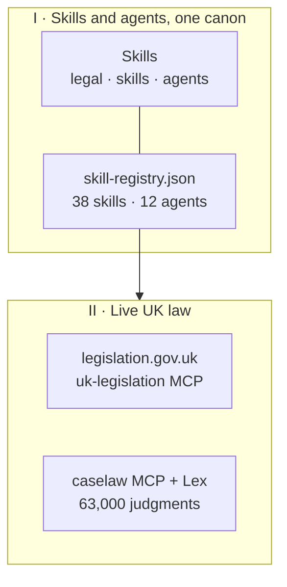

# Repository Structure

This repository is composed of three main components: the agent-host skill system (skills + agents), the MCP servers (legislation + caselaw), and supporting scripts/templates.

A hosted web app, The Counsel (https://the-counsel.co.uk), is built on these same skills but lives in a separate repository.


*Figure 1 — the 2026 system map.*


*Figure 1.a — the broadsheet rebrand of the older framing.*


*Figure 1.b — the original architecture plate, kept for reference.*

::: details Mermaid source — the diagram above is generated from this



:::

## Directory Tree

```
uk-legal-skills/
├── legal/SKILL.md              — Main orchestrator (routes /legal commands)
├── skills/legal-*/SKILL.md     — 38 individual skill files
├── agents/legal-*.md           — 12 agent definitions (the panel)
├── mcp-servers/                — Two local MCP servers
│   ├── uk-legislation/src/     — 6 legislation.gov.uk tools
│   └── caselaw/src/            — 10 National Archives judgment tools
├── doc-site/                   — VitePress public docs
├── scripts/
│   ├── generate_legal_pdf.py   — Python PDF report generator (ReportLab)
│   ├── audit_skills.mjs        — 38-skill ↔ 12-agent parity guardrail
│   └── audit_docs.mjs          — Registry ↔ docs parity check
├── samples/                    — Sample legal documents for testing
├── templates/                  — Report templates
├── install.sh                  — Install skills into ~/.claude/
├── uninstall.sh                — Remove installed skills
├── .mcp.json                   — MCP server configuration (uk-legislation · caselaw · lex)
├── CLAUDE.md                   — Project instructions for Claude Code
└── AGENTS.md                   — Mirror of CLAUDE.md for Codex and other AGENTS.md-aware hosts
```

## Component Overview

### Agent-Host Skills (`legal/`, `skills/`, `agents/`)

The primary CLI interface. Users run `/legal <command>` inside Codex, Claude Code, or another compatible agent host, and the orchestrator in `legal/SKILL.md` routes to the appropriate skill file. Skills are pure markdown prompts -- no compilation, no dependencies, no runtime code. Agents are launched by orchestrator skills for parallel analysis.

::: info
Skills and agents are installed into the configured host directory by running `./install.sh`. They are removed with `./uninstall.sh`.
:::

### MCP Servers (`mcp-servers/`)

Two TypeScript MCP servers ship with the repo, plus one remote HTTP server. All three are registered in `.mcp.json`:

| Entry | Type | Source | Purpose |
|-------|------|--------|---------|
| `uk-legislation` | local stdio | `mcp-servers/uk-legislation/` | 6 tools against legislation.gov.uk's XML API — search, lookup, in-force, amendments, extent |
| `caselaw` | local stdio | `mcp-servers/caselaw/` | 10 tools against caselaw.nationalarchives.gov.uk — search, judgment lookup, summarise, by-judge / by-party |
| `lex` | remote HTTP | `https://lex.lab.i.ai.gov.uk/mcp` | 63,000+ judgments with semantic search via the National Archives Lex Graph |

### Scripts (`scripts/`)

Supporting utilities, primarily `generate_legal_pdf.py` which generates professional A4 PDF reports using Python's `reportlab` library. Called by the `legal-report-pdf` skill.

### Samples & Templates (`samples/`, `templates/`)

Sample legal documents for testing and development, and report templates used by the PDF generator.

## Editing the Skill Surface

Skills and agents are plain markdown, so changes take effect the next time `./install.sh` copies them into the host directory:

| Change | Affects |
|--------|---------|
| Edit `skills/legal-review/SKILL.md` | The `/legal review` skill surface |
| Edit `agents/legal-clauses.md` | The clause-analysis agent used by the review orchestrator |
| Edit `skills/legal-*/SKILL.md` | The corresponding `/legal <command>` skill |

All skills share the same jurisdiction scope (England & Wales) and the canonical register in `skills/` — there is no compilation step and no runtime code to rebuild.
