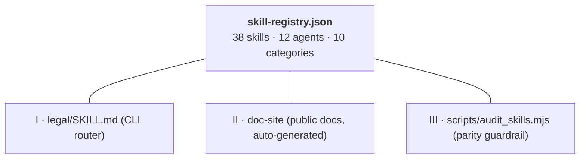

# Skills System

Skills are the fundamental building block of UK Legal Skills. Each skill is a self-contained markdown prompt that instructs an agent host how to analyse a specific type of legal document or perform a specific legal task.

## Skill File Structure

Every skill lives in its own directory under `skills/`. The full register is **38 skills** — the canonical source is `registry/skill-registry.json`, enforced by `scripts/audit_skills.mjs`.


::: details Mermaid source — the diagram above is generated from this



*Edit one — the audit enforces the other three.*

:::

```
skills/
├── legal-review/SKILL.md            ← orchestrator (5 parallel agents)
├── legal-employment/SKILL.md        ← orchestrator (4 parallel agents)
├── legal-corporate/SKILL.md         ← orchestrator (3 parallel agents)
└── legal-*/SKILL.md                 ← 35 single-agent or utility skills
```

For the complete, up-to-date list of skills, run `scripts/audit_skills.mjs` or read `registry/skill-registry.json`. The list is intentionally not duplicated here so it cannot drift.

## Anatomy of a SKILL.md

Each SKILL.md file contains these sections:

### 1. YAML Frontmatter

```yaml
---
name: Contract Review
description: Full contract review with 5 parallel agents
---
```

### 2. Jurisdiction Pin

Every skill explicitly states: **England & Wales only**. This prevents the AI from drifting into Scottish or Northern Irish law.

### 3. Disclaimer Block

The standard AI-generated analysis disclaimer appears in every skill, ensuring it is included in all output.

### 4. Purpose Statement

What the skill does, what document types it handles, and what the user can expect.

### 5. Input Handling

Skills accept input in three ways:

| Method | How It Works |
|--------|-------------|
| **File path** | The Read tool reads the file directly from disk |
| **Pasted text** | User pastes the document content into the chat |
| **URL** | WebFetch retrieves the document from a URL |

::: tip
This input trichotomy is consistent across all skills. When editing ingestion phases, always preserve all three options.
:::

### 6. Analysis Framework

The core of the skill -- structured phases that guide the model through the analysis. For example:

- **Phase 1: Ingestion** -- classify the document type, extract metadata
- **Phase 2: Analysis** -- clause-by-clause review, risk scoring, compliance checks
- **Phase 3: Synthesis** -- aggregate findings, calculate scores, generate recommendations

### 7. Output Format Template

A detailed template specifying the exact structure of the output, including section headings, table formats, scoring displays, and recommendation layouts.

### 8. File Naming Convention

The pattern for saving the output file:

```
CONTRACT-REVIEW-[name]-[YYYY-MM-DD].md
```

## The Orchestrator

The main orchestrator at `legal/SKILL.md` is the entry point for all `/legal` commands. It contains:

1. **Command menu** -- displayed when users type `/legal` without arguments
2. **Routing table** -- maps each command to its skill directory
3. **Input handling rules** -- the three-way input trichotomy
4. **File naming conventions** -- standardised output file names
5. **Disclaimer** -- the standard disclaimer text
6. **Tone and style guide** -- professional but accessible, with risk indicators

## Key Design Principles

### Self-Contained

Each skill is a complete, standalone prompt. There is no shared library, no imported modules, no runtime code. You can read a single SKILL.md file and understand everything about that skill.

### No Runtime Dependencies

Skills are pure markdown. They require only a compatible agent host to run -- no package installation, no build step, no configuration.

### Consistent Structure

All skills follow the same structural pattern, making them predictable to read, edit, and extend.

## Adding a New Skill

To add a new `/legal` command:

1. Create the directory: `skills/legal-yourskill/`
2. Write `SKILL.md` following the standard structure
3. Update the routing table in `legal/SKILL.md`
4. Run `./install.sh` to deploy

See the [Adding Skills guide](/contributing/adding-skills) for detailed instructions.
